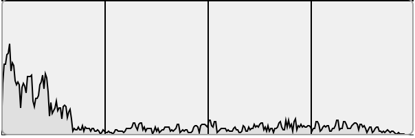
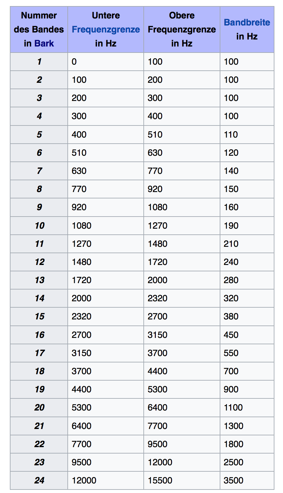
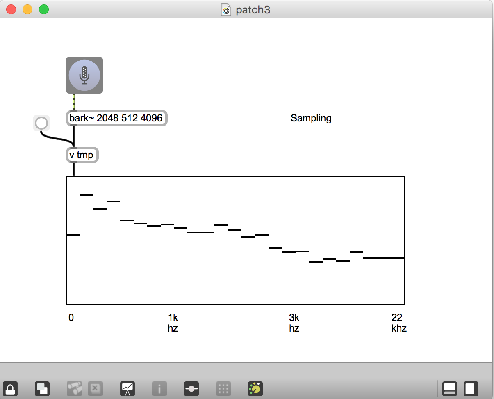
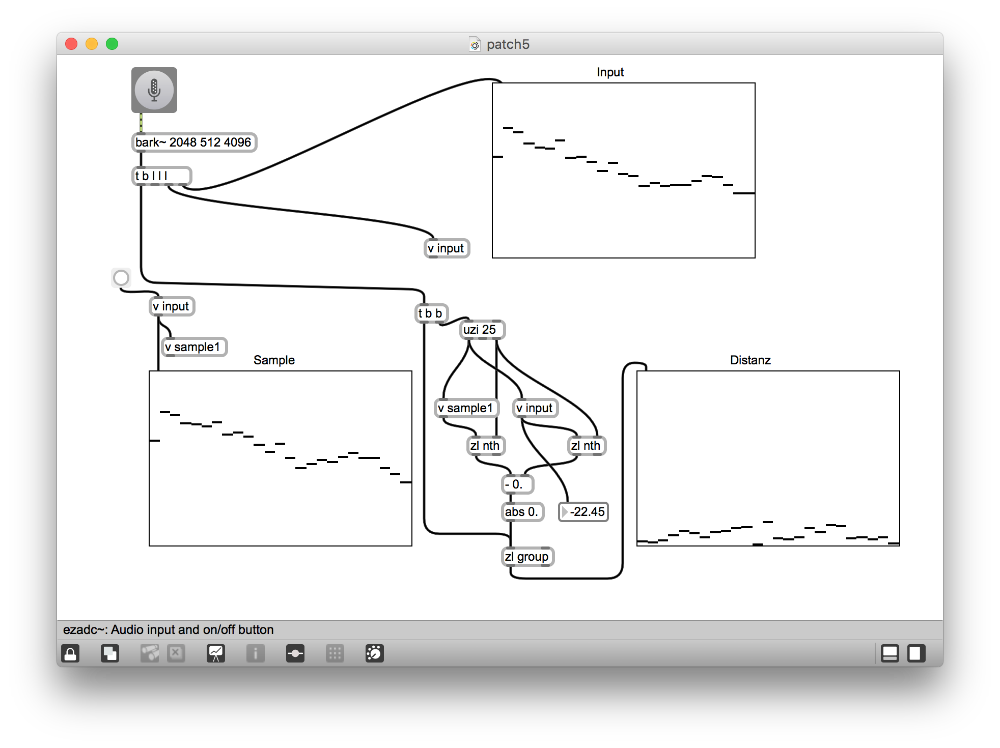
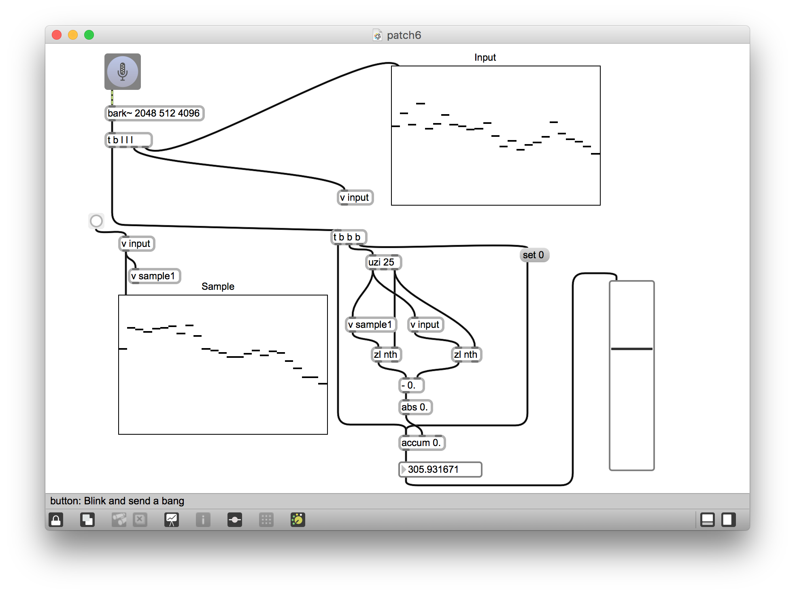
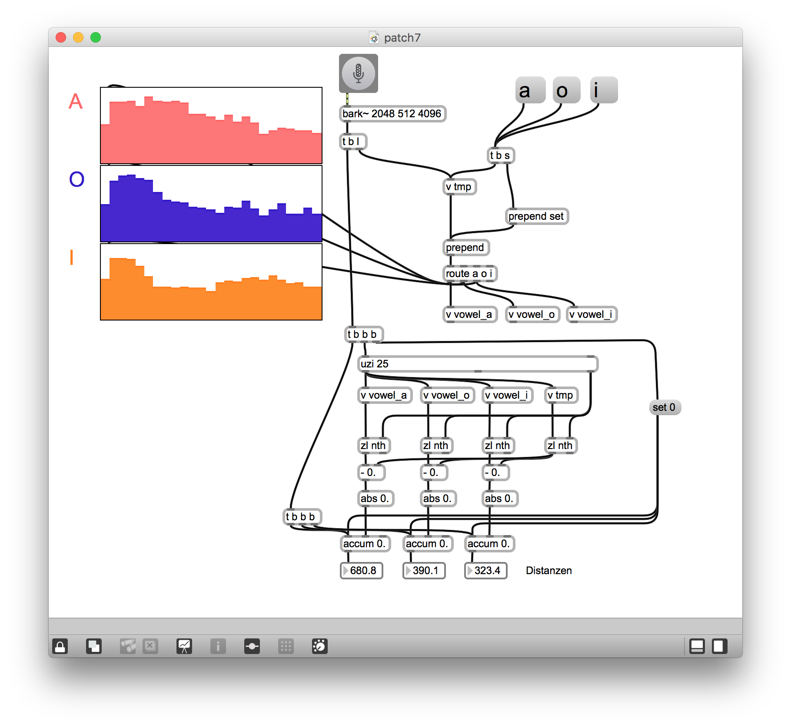

#Klasse3 - Klangfarbeerkennung

### Klangfarbe

Spektrum

a...

e...

s...

Spektrum = wissenschaftliche Darstellung

Unsere Wahrnemung der Tonhöhe ist nicht Linear.

### Frequenzgruppen

 Mit Frequenzgruppen (engl. critical bands) bezeichnet man beim menschlichen Hören Frequenzbereiche, die gemeinsam ausgewertet werden. Eine Auswertung in Frequenzgruppen erfolgt z. B. bei der Bestimmung der **Lautstärke**, des Klangs oder der Richtung des Schalls. Eine Ausnahme ist die Auswertung der Tonhöhe selbst: hier ist die Frequenzauflösung wesentlich größer. Das menschliche Gehör teilt die hörbaren Frequenzen in etwa 24 Frequenzgruppen ein.

### Bark Skala

## patch1: bark~

## patch2: Visualisierung

## patch3: Bark Skala Sampling mit tmp

## patch4: 3x Bark Skala Sampling 

## patch5: Messung der Distanz zwischen zwei Skalen

## patch6: Summe

## patch7: Distanzen

## patch8: Normalisierung

## patch9: Minimum

## patch10: Thresholding
